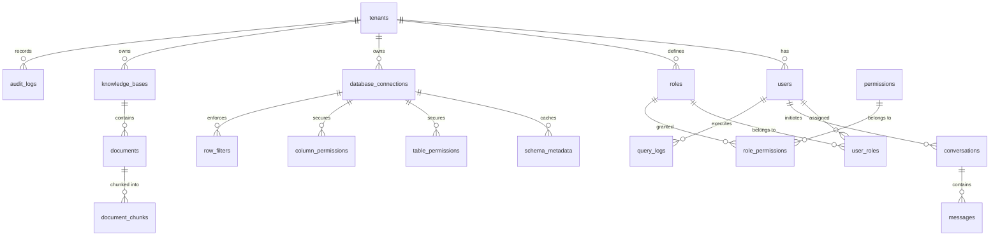

# Entity Relationship (ER) Diagram

## Tables Summary

1. `tenants`: Primary multi-tenant boundary.
2. `users`: Tenant users with Argon2id hashed passwords.
3. `roles`: Tenant-customizable roles.
4. `permissions`: Platform-wide atomic resource:action permissions.
5. `refresh_tokens`: Revocable hashed refresh session tokens.
6. `audit_logs`: Immutable security audit trail with JSONB payloads.
7. `database_connections`: Encrypted runtime database connection details.
8. `schema_metadata`: Cached database schema introspection (no customer data).
9. `table_permissions`: Table query permission configuration per role.
10. `column_permissions`: Column visibility and filterability per role.
11. `row_filters`: Server-side mandatory WHERE clause filters.
12. `knowledge_bases`: Named collections of documents.
13. `documents`: Document upload tracking and status lifecycle.
14. `document_chunks`: Extracted text chunks with 1536-dim pgvector embeddings.
15. `conversations`: Chat sessions with specified execution mode.
16. `messages`: Conversation turns with SQL, results, and citations.
17. `query_logs`: Detailed audit log of every generated and executed SQL query.
